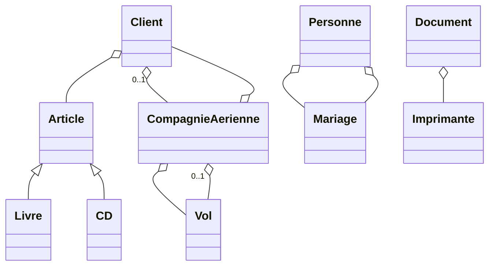

# TD3uml

```mermaid
classDiagram
  class Article
  class Livre
  class CD
  class Client
  class CompagnieAerienne
  class Vol
  class Personne
  class Mariage
  class Document
  class Imprimante

  Article <|-- Livre
  Article <|-- CD
  Client o-- Article
  CompagnieAerienne o-- Vol
  CompagnieAerienne o-- Client
  Personne o-- Mariage
  Personne o-- Mariage
  Document o-- Imprimante

  Client "0..1" o-- CompagnieAerienne
  CompagnieAerienne "0..1" o-- Vol
```
