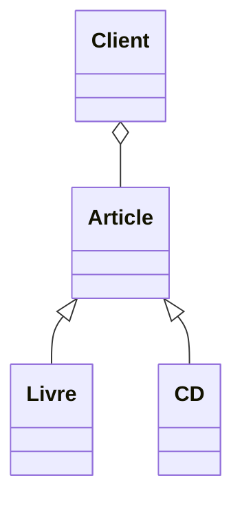
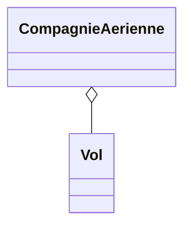
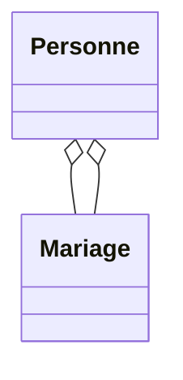
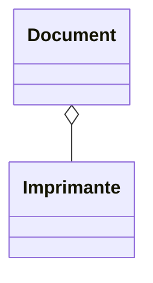

# TD3uml

```mermaid
classDiagram
  class Article
  class Livre
  class CD
  class Client
  Article <|-- Livre
  Article <|-- CD
  Client o-- Article
```

```mermaid
classDiagram
  class CompagnieAerienne
  class Vol
  CompagnieAerienne o-- Vol
```

```mermaid
classDiagram
  class Personne
  class Mariage
  Personne o-- Mariage
  Personne o-- Mariage
```

```mermaid
classDiagram
  class Document
  class Imprimante
  Document o-- Imprimante
```

