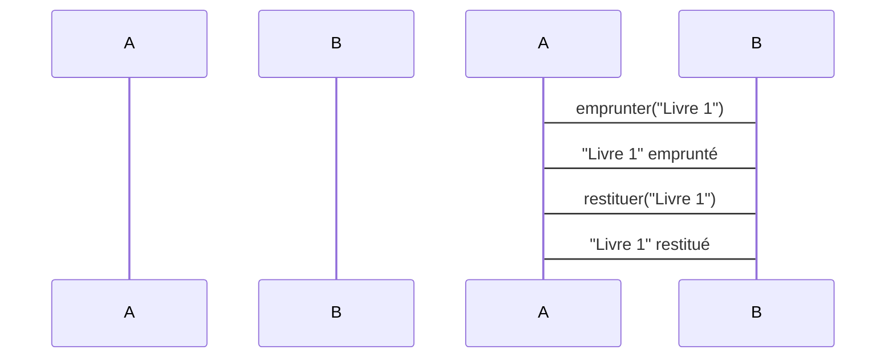

# TD3uml

```mermaid
sequenceDiagram
participant "Adherent" as A
participant "Bibliotheque" as B

A -> B : emprunter("Livre 1")
B -> A : "Livre 1" emprunté
A -> B : restituer("Livre 1")
B -> A : "Livre 1" restitué


```
