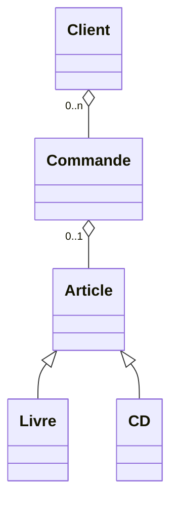
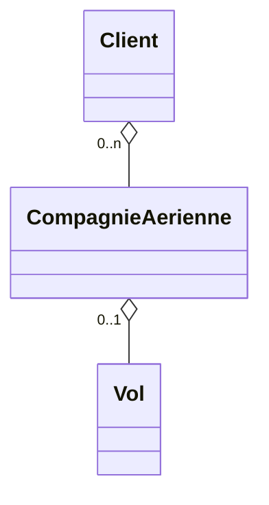
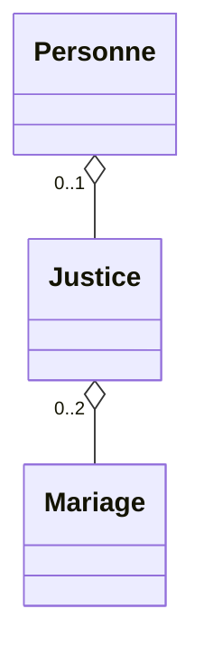
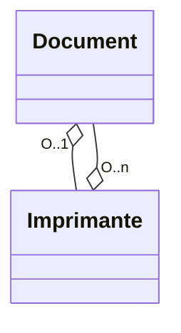

# TD3uml 

## EXO 1









## EXO 2

```mermaid
classDiagram
    class RailwaySystem {
        - railways: list<Railway>
        + addRailway(): void
        + addStation(): void
    }

    class Train {
        - origin: Station
        - destination: Station
        - currentStation: Station
        - isMoving: boolean
        + startJourney(): void
        + stopJourney(): void
        + move(): void
        // Add other attributes specific to trains
    }

    class Station {
        - name: String
        - sensors: list<Sensor>
        - trains: list<Train>
        + addSensor(): void
        + getName(): String
        + addTrain(train: Train): void
    }

    class Railway {
        - stations: list<Station>
        - barriers: list<Barrier>
        + addStation(): void
        + addBarrier(): void
        + openBarrier(): void
        + closeBarrier(): void
    }

    class Barrier {
        - isOpen: boolean
        - sensor: Sensor
        + open(): void
        + close(): void
    }

    class Sensor {
        // properties of the sensor
    }

    RailwaySystem --> Railway
    RailwaySystem --> Station
    Train --> Station: origin
    Train --> Station: destination
    Train --> Station: currentStation
    Train --> Barrier
    Station --> Sensor: 0..*
    Station --> Train: 0..*
    Railway --> Station: 2..*
    Railway --> Barrier: 0..*
    Barrier --> Sensor

````
## TD6

```mermaid

classDiagram
  class Player {
    - playerId: int
    - username: string
    - email: string
    - friends: List<Player>
    + buyEquipment(equipment: Equipment): void
    + startGame(characters: List<Character>): void
    + leaveGame(): void
    + retrieveEmail(): string
  }

  class Equipment {
    - equipmentId: int
    - name: string
    - price: float
  }

  class Character {
    - characterId: int
    - name: string
    - type: string
  }

  class Game {
    - gameId: int
    - date: Date
    - duration: int
    + updateScore(player: Player, score: int): void
  }

  class Transaction {
    - transactionId: int
    - date: Date
    - amount: float
  }

  class Moderator {
    + creditPlayer(player: Player, amount: float): void
    + retrievePlayerEmail(player: Player): string
  }

  Player --|> Transaction
  Player --|> Character
  Player --|> Game
  Player --|> Moderator
  Player *-- friends: Player
  Player --> Equipment: has
  Player --> Transaction: makes
  Game --> Player: players
  Game --> Character: characters
  Game --> Transaction: transactions
  Moderator --> Player: interacts with

```
