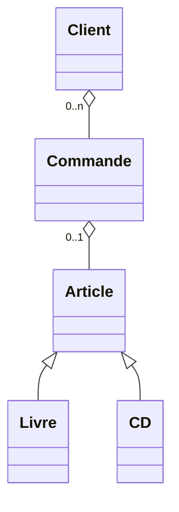
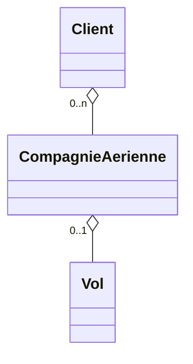
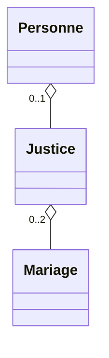
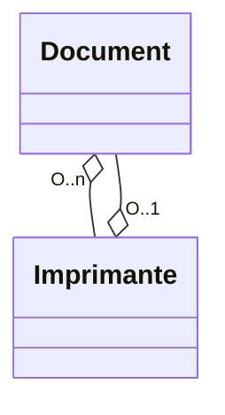

# TD3uml

```mermaid
classDiagram
  class Article
  class Livre
  class CD
  class Client
  Class Commande
  Article <|-- Livre
  Article <|-- CD
  
  Client "0..n" o-- Commande
  Commande "0..1" o-- Article
```

```mermaid
classDiagram
  class CompagnieAerienne
  class Vol
  class Client

  Client "0..n" o-- CompagnieAerienne
  CompagnieAerienne "0..1" o-- Vol
```

```mermaid
  classDiagram
  class Personne
  class Justice
  class Mariage

  Personne "0..1" o-- Justice
  Justice "0..2" o-- Mariage
```

```mermaid
classDiagram
  class Document
  class Imprimante

  Document "O..n" o-- Imprimante
 Imprimante "O..1" o-- Document
```
